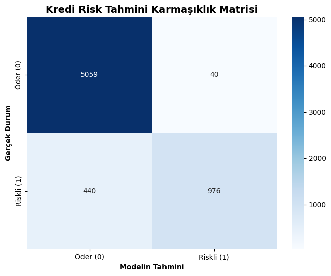

# 🏦 Yapay Sinir Ağları (YSA) ile Bireysel Kredi Risk Tahmini

🚀 **Canlı Demo (Web Uygulaması):** [Kredi Risk Tahmin Sistemini Deneyin](https://enes-kredi-risk.streamlit.app/)

Bu proje, bankacılık sektöründe sıkça karşılaşılan bireysel kredi temerrüt (default) riskini tahmin etmek amacıyla uçtan uca geliştirilmiş bir **Makine Öğrenmesi ve Derin Öğrenme** boru hattıdır (pipeline). Model sadece bir sınıflandırma yapmakla kalmaz; veri ön işleme, istatistiksel temizlik, finansal risk analizi ve **interaktif bir web arayüzü** süreçlerini kapsar.

## ⚙️ Kullanılan Teknolojiler ve Mimari
* **Dil:** Python
* **Web Arayüzü ve Dağıtım:** Streamlit
* **Veri İşleme (Data Engineering):** Pandas, NumPy
* **Makine Öğrenmesi & Ölçeklendirme:** Scikit-Learn
* **Derin Öğrenme Mimarisi:** TensorFlow / Keras (Multi-Layer Perceptron)
* **Veri Görselleştirme:** Matplotlib, Seaborn

## 🛠️ Veri Mühendisliği (Data Preprocessing) Adımları
Gerçek dünya verilerindeki kirlilik ve eksiklikler, modele verilmeden önce veritabanı mantığıyla aşağıdaki adımlardan geçirilerek temizlenmiştir:
1. **Eksik Veri Yönetimi:** `person_emp_length` (çalışma süresi) ve `loan_int_rate` (faiz oranı) sütunlarındaki null değerler, aykırı değerlerden etkilenmemesi adına **medyan (ortanca)** ile dolduruldu.
2. **Aykırı Değer (Outlier) Temizliği:** Yaşı 144, çalışma süresi 123 yıl gibi veri giriş hataları barındıran satırlar mantıksal operatörlerle (yaş < 100 vb.) filtrelendi.
3. **Kategorik Dönüşüm (One-Hot Encoding):** Metin tabanlı özellikler matris formatına çevrildi. Çoklu doğrusal bağlantıyı (Multicollinearity) ve Kukla Değişken Tuzağını (Dummy Variable Trap) engellemek için `drop_first=True` parametresi uygulandı.
4. **Ölçeklendirme (Scaling):** Ağırlıkların (weights) optimizasyon sırasında domine edilmesini engellemek için tüm özellikler `StandardScaler` ile 0 ortalama ve 1 standart sapma olacak şekilde normalize edildi.

## 🧠 Model Mimarisi
Projede **Çok Katmanlı Algılayıcı (MLP)** kullanılmıştır.
* **Girdi Katmanı:** 22 özellik (feature).
* **Gizli Katmanlar:** 64 ve 32 nöronlu iki katman. Kaybolan gradyan problemini önlemek için **ReLU** aktivasyon fonksiyonu kullanıldı.
* **Regularizasyon:** Ağın ezberlemesini (Overfitting) engellemek için %20 oranında **Dropout** katmanları eklendi.
* **Çıktı Katmanı:** Tek nöron ve risk olasılığını hesaplamak için **Sigmoid** aktivasyon fonksiyonu kullanıldı. Optimizasyon için `adam`, hata fonksiyonu olarak `binary_crossentropy` tercih edildi.

## 📊 Sonuçlar ve Performans Analizi
Model 50 epoch boyunca eğitilmiş ve daha önce hiç görmediği %20'lik test verisi üzerinde sınanmıştır.

* **Genel Doğruluk (Accuracy):** %93
* **Riskli Müşteriyi Tespit Kesinliği (Precision):** %96 

> **Finansal Risk Yorumu:** Karmaşıklık Matrisi (Confusion Matrix) incelendiğinde, modelin "Riskli" dediği müşterilerin %96'sının gerçekten batık olduğu görülmüştür. Ancak dünyadaki tüm riskli müşterileri yakalama duyarlılığımız (Recall) %69 seviyesinde kalmıştır. Banka açısından bu 440 müşterinin (False Negative) gözden kaçmasının temel matematiksel sebebi veri setindeki **Sınıf Dengesizliğidir (Imbalanced Data)**. 



## 🚀 Gelecek Çalışmalar (Future Work)
Bir sonraki fazda, düşük kalan **Recall** değerini artırmak ve modelin azınlık sınıfı (riskli müşteriler) üzerindeki hassasiyetini güçlendirmek için **SMOTE** (Sentetik Azınlık Aşırı Örnekleme Tekniği) algoritması entegre edilecektir.

## 💻 Nasıl Çalıştırılır?

Projeyi kendi bilgisayarınızda yerel (local) olarak çalıştırmak için aşağıdaki adımları izleyebilirsiniz:

1. Repoyu klonlayın:
   ```bash
   git clone [https://github.com/enesornk/Credit-Risk-Estimation.git](https://github.com/enesornk/Credit-Risk-Estimation.git)
2. Gerekli kütüphaneleri kurun:
    ```bash
    pip install -r requirements.txt
3. Web Arayüzünü Başlatmak İçin:
    ```bash
   streamlit run app.py
4. Model Eğitim Süreçlerini İncelemek İçin:
    kredi_modeli.ipynb dosyasını Jupyter Notebook üzerinden açarak kod bloklarını adım adım çalıştırabilirsiniz.